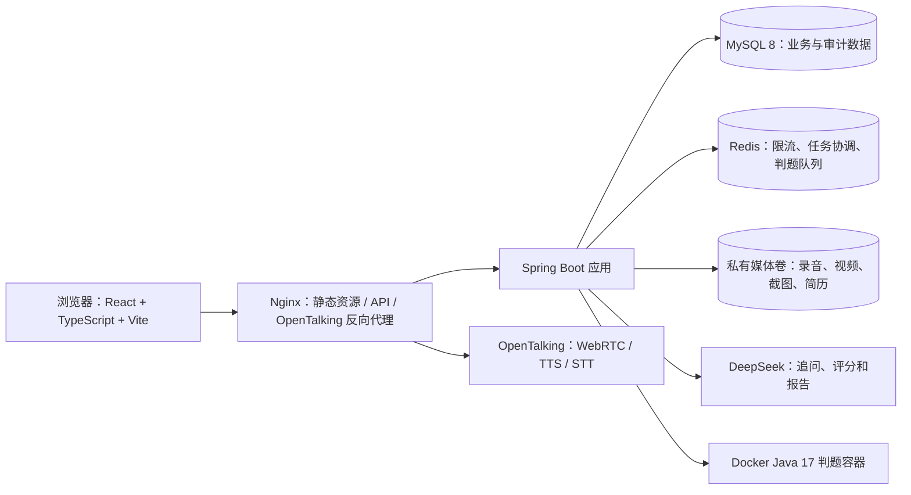
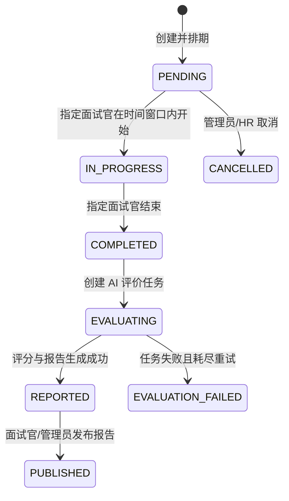

# AI 多模态智能模拟面试评测平台：系统设计（第二阶段）

## 1. 总体架构

采用前后端分离的模块化单体架构。业务 API、AI 编排、持久化工单和异步任务在同一 Spring Boot 应用中组织，通过模块边界保持后续拆分能力；媒体当前保存到受保护的本地 Docker 卷，MySQL 为事实数据源，Redis 负责限流、短期协调与算法判题队列。OpenTalking 独立运行并通过 Nginx 同源代理接入。



## 2. 后端模块与分层

根包：`com.tyut.aiinterview`。保持 Controller、Service、Mapper 清晰分层，禁止 Controller 直接访问 Mapper。

```text
backend/src/main/java/com/tyut/aiinterview
├── common/                  # Result、PageResult、常量、分页、请求上下文
├── config/                  # 应用属性、Redis、限流、上传安全和异步配置
├── security/                # JWT、认证过滤器、权限表达式、当前用户
├── utils/                   # 安全、文件、时间、JSON 工具
├── auth/                    # Controller / Service / DTO / VO / Query
├── user/                    # 用户、角色、用户角色与个人中心
├── position/                # 岗位与能力模型
├── question/                # 分类、题库、题目、AI 题目生成
├── interview/               # 创建、状态机、题目编排、答案与历史记录
├── media/                   # 媒体上传、文件签名校验和鉴权内容访问
├── ai/                      # DeepSeek 适配、AI 审计、追问质量与任务 Worker
├── algorithm/               # 算法题、判题任务、提交、进度、收藏和笔记
├── freeinterview/           # 简历解析与自由面试
├── recording/               # 面试方式、录制分段和时间轴
├── reflection/              # 候选人面试心得
├── prompt/                  # 提示词不可变版本、激活和回滚
├── notification/            # 邮件同步与持久化站内通知
├── ticket/                  # 反馈工单、状态机、转派、留言和附件授权
├── learning/                # 学习资料、PDF 版本、查看权限和批注
├── evaluation/              # AI/人工评价及复核
├── report/                  # 报告、PDF、发布
├── settings/                # AI Provider 配置与密钥保护
├── virtualhuman/            # OpenTalking 配置与健康检查边界
├── observability/           # Actuator/Prometheus 项目指标
├── domain/                  # 与表对应的 MyBatis-Plus Entity
└── mapper/                  # MyBatis Plus Mapper
```

当前代码按业务包组织 Controller、Service 和 DTO，实体与 Mapper 分别集中在 `domain/`、`mapper/`；Controller 不直接访问 Mapper，跨模块写操作通过 Service 协调并使用事务保护。

## 3. 前端架构

```text
frontend-react/src
├── components/              # 页面壳、通用 UI、算法、工单、通知与确认弹窗
├── lib/                     # API 请求、认证、工单、通知、OpenTalking、语音和状态工具
├── pages/                   # 候选人、管理端、面试、算法、反馈工单与学习资料页面
├── app.tsx                  # React Router 路由、懒加载和角色入口
└── styles.css               # 主题、设计令牌、响应式和打印样式
```

候选人使用候选人公共页面壳，管理员使用管理端页面壳，面试房间使用独立沉浸式布局。前端路由守卫只改善体验，最终权限以服务端角色和资源归属校验为准。

## 4. 权限模型与接口规范

### 授权原则

- JWT 仅携带用户 ID、用户名、角色和过期时间；服务端每次校验签名与用户启用状态。
- 当前管理页面主要使用 `ADMIN`，候选人功能使用 `CANDIDATE`；历史角色表仍保留 `HR` 和 `INTERVIEWER`，具体接口同时执行资源归属校验。
- 文件访问由后端受保护接口校验媒体所有者、面试参与者或工单参与者；对象键不由前端决定。
- 所有管理端变更记录操作审计。

### REST 规范

- 路径统一为 `/api/v1/**`，资源名用复数名词。
- 成功返回 `Result<T>`；分页返回 `PageResult<T>`，字段包含 `records`、`total`、`pageNo`、`pageSize`。
- 查询参数由 `*Query` 承载；写入参数由 `*Request` DTO 承载；响应为 `*VO`，禁止直接返回 Entity。
- 错误响应固定包含 `code`、`message`、`requestId`、`timestamp`；使用 RFC 风格 HTTP 状态码。
- OpenAPI 3 文档由 springdoc-openapi 暴露；生产环境应通过网络边界或管理员策略限制访问。

## 5. 面试、答案与评价状态机



对现有 `interview.status` 保持 `PENDING / IN_PROGRESS / COMPLETED / CANCELLED` 四态；AI 处理、失败与报告发布状态由 `ai_task`、`evaluation` 和 `report` 表表达，避免单一状态字段混入多个职责。

答案采用幂等写入：唯一键为 `interview_question_id`。候选人只能在 `IN_PROGRESS` 期间写入；音频/视频由媒体表引用，转写与分析结果作为独立任务输出。

## 6. AI 与多媒体处理设计

### AI 与虚拟人适配层

- `DeepSeekGateway`：负责追问、自由面试、评分和报告；读取已启用 Provider 与提示词版本，并记录请求标识、模型、耗时、Token 和结果状态。
- `OpenTalking`：负责 WebRTC 虚拟人媒体、TTS/STT；平台生成最终展示文本后以只朗读模式提交，避免虚拟人再次改写内容。
- 浏览器语音能力仅作为 OpenTalking 不可用时的降级路径。
- 所有第三方客户端使用服务端配置、脱敏日志和统一错误映射，密钥不进入浏览器。

### 异步任务

长耗时动作先创建 `ai_task` 数据行，再由受控线程池和轮询 Worker 执行；数据库中的任务状态是最终可信状态，Redis 仅承担限流和判题等短期协调。任务按重试策略恢复，达到最大次数后标记失败并暴露指标。

当前核心任务包括模拟面试 `FOLLOW_UP`、评分/报告任务，以及自由面试 `FREE_ANALYSIS`、`FREE_FOLLOW_UP`、`FREE_REPORT`；算法提交使用独立 Redis 判题队列。

### 学习资料与 PDF 批注

- 管理员通过 `/v1/admin/learning-resources` 上传 PDF；文件继续经过现有 MIME/文件签名、大小、SHA-256 和可选 ClamAV 校验，并写入私有媒体卷。
- `learning_resource` 保存资料状态和下载开关，`learning_resource_version` 保存文件摘要、原始文件名、页数和媒体引用；资料内容不作为公开静态文件发布。
- `learning_resource_permission` 支持按用户或角色授予查看/批注权限及过期时间。候选人列表、详情、内容、下载和批注请求都在服务端重新校验权限，前端路由守卫不是安全边界。
- PDF.js 在浏览器内渲染页面和文本层，批注使用相对页面坐标保存到 `learning_resource_annotation`，默认只对批注所有者可见；批注更新通过版本号避免并发覆盖，原始 PDF 不被修改。
- 生产 Nginx 显式将 `.mjs` worker 返回为 `application/javascript`，避免浏览器将 PDF.js worker 当作不支持的 `application/octet-stream` 模块。

## 7. 部署拓扑与配置

Docker Compose 提供开发/单机部署：`frontend`（React/Nginx）、`backend`、`mysql`、`redis` 和按 profile 构建的 `java-runner`。OpenTalking 作为独立上游运行。Linux 生产环境使用环境变量或密钥管理服务注入配置，不将 `.env`、JWT 密钥、AI Key 或数据库密码提交仓库。

核心环境变量：`DB_URL`、`DB_USERNAME`、`DB_PASSWORD`、`REDIS_HOST`、`REDIS_PASSWORD`、`JWT_SECRET`、`DEEPSEEK_API_KEY`、`OPENTALKING_UPSTREAM`、`MEDIA_STORAGE_ROOT` 和判题 Worker 配置。

Nginx 提供 SPA 回退、`/api` 代理、上传大小限制、TLS 终止和基础安全响应头。应用公开 `/actuator/health`，其余 Actuator 端点仅限内部网络或管理员访问。

## 8. 质量策略

- 后端：当前 Maven 测试覆盖上下文、关键 Service、权限/安全、AI 任务、录制与报告；下一步补充工单并发和 Testcontainers 集成测试。
- 前端：当前执行 TypeScript 生产构建与 ESLint；下一步补充组件测试和关键用户路径 Playwright 回归。
- CI：当前执行后端测试、前端构建/Lint 和 Compose 配置校验；下一步补充依赖漏洞、Secret、镜像、SBOM 和来源证明门禁。
- 观测：结构化日志、requestId、任务失败告警、慢接口/AI 调用耗时指标。

## 9. 当前结构演进原则

数据库结构以 `backend/src/main/resources/db/migration/` 为唯一 Flyway 来源，当前至 V26，后续从 V27 开始。继续保持模块化单体，优先通过测试、权限隔离、可观测性和部署可靠性提升成熟度；只有判题 Worker、AI Worker 或 OpenTalking 出现明确的独立扩容/故障隔离需求时再拆分部署单元。
