# AI 多模态智能模拟面试评测平台：数据库设计（第三阶段）

## 1. 设计约定

- 数据库：MySQL 8.0+，InnoDB，`utf8mb4_0900_ai_ci`。
- 主键统一使用 `BIGINT UNSIGNED`；所有时间使用 `DATETIME`，由应用以 `Asia/Shanghai` 业务时区写入。
- 可软删除的业务表使用 `deleted_at DATETIME NULL`：`NULL` 表示有效记录，禁止以 `0/1` 表示时间型逻辑删除。
- 密码只保存 BCrypt 哈希；令牌只保存不可逆哈希；媒体对象只保存对象存储定位信息。
- 外键保护核心引用完整性；高并发读写表使用与查询路径匹配的复合索引。

## 2. 实体关系图

```mermaid
erDiagram
  USER ||--o{ USER_ROLE : has
  ROLE ||--o{ USER_ROLE : grants
  ROLE ||--o{ ROLE_PERMISSION : contains
  PERMISSION ||--o{ ROLE_PERMISSION : assigned
  QUESTION_CATEGORY ||--o{ QUESTION_BANK : groups
  JOB_POSITION ||--o{ QUESTION_BANK : scopes
  QUESTION_BANK ||--o{ QUESTION : contains
  JOB_POSITION ||--o{ INTERVIEW : targets
  USER ||--o{ INTERVIEW : candidate
  USER ||--o{ INTERVIEW : interviewer
  INTERVIEW ||--o{ INTERVIEW_QUESTION : selects
  QUESTION ||--o{ INTERVIEW_QUESTION : snapshot_source
  INTERVIEW_QUESTION ||--o| INTERVIEW_ANSWER : receives
  MEDIA_FILE ||--o{ INTERVIEW_ANSWER : attaches
  INTERVIEW ||--o| INTERVIEW_RECORDING : records
  INTERVIEW_RECORDING ||--o{ INTERVIEW_RECORDING_SEGMENT : splits
  INTERVIEW_RECORDING ||--o{ INTERVIEW_TIMELINE_EVENT : aligns
  INTERVIEW_QUESTION ||--o{ INTERVIEW_RECORDING_SEGMENT : plays
  INTERVIEW_QUESTION ||--o{ INTERVIEW_TIMELINE_EVENT : marks
  MEDIA_FILE ||--o{ INTERVIEW_RECORDING_SEGMENT : stores
  INTERVIEW ||--o{ AI_SESSION : owns
  AI_SESSION ||--o{ AI_MESSAGE : contains
  INTERVIEW ||--o{ AI_TASK : schedules
  INTERVIEW_QUESTION ||--o{ EVALUATION : evaluated_by
  INTERVIEW ||--o| REPORT : produces
  INTERVIEW ||--o| INTERVIEW_REFLECTION : reflects
  USER ||--o{ INTERVIEW_REFLECTION : writes
  USER ||--o{ REFRESH_TOKEN : authenticates
  USER ||--o{ OPERATION_LOG : operates
  USER ||--o{ FEEDBACK_TICKET : creates
  USER ||--o{ FEEDBACK_TICKET : handles
  FEEDBACK_TICKET ||--o{ FEEDBACK_TICKET_ACTIVITY : contains
  FEEDBACK_TICKET ||--o{ FEEDBACK_TICKET_ATTACHMENT : attaches
  MEDIA_FILE ||--o| FEEDBACK_TICKET_ATTACHMENT : stores
  FEEDBACK_TICKET ||--o{ FEEDBACK_TICKET_READ_STATE : tracks
  USER ||--o{ FEEDBACK_TICKET_READ_STATE : reads
  USER ||--o{ SITE_NOTIFICATION : receives
  USER ||--o{ LEARNING_RESOURCE : creates
  LEARNING_RESOURCE ||--o{ LEARNING_RESOURCE_VERSION : versions
  MEDIA_FILE ||--o{ LEARNING_RESOURCE_VERSION : stores
  LEARNING_RESOURCE ||--o{ LEARNING_RESOURCE_PERMISSION : grants
  LEARNING_RESOURCE ||--o{ LEARNING_RESOURCE_ANNOTATION : contains
  LEARNING_RESOURCE_VERSION ||--o{ LEARNING_RESOURCE_ANNOTATION : anchors
  USER ||--o{ LEARNING_RESOURCE_ANNOTATION : writes
```

## 3. 表职责

| 分组 | 表 | 职责 |
| --- | --- | --- |
| 身份与授权 | `user`、`role`、`permission`、`user_role`、`role_permission`、`refresh_token` | 账号、RBAC、刷新令牌 |
| 招聘资产 | `job_position`、`question_category`、`question_bank`、`question` | 岗位能力模型、分类、题库与题目 |
| 面试过程 | `interview`、`interview_question`、`interview_answer`、`media_file`、`interview_recording`、`interview_recording_segment`、`interview_timeline_event` | 排期、题目快照、作答、媒体对象、面试方式、录制分段与时间轴 |
| AI 能力 | `ai_session`、`ai_message`、`ai_task` | 多轮对话、追问、转写、评分、任务重试 |
| 评价与报告 | `evaluation`、`report`、`interview_reflection` | AI/人工评分、报告生成与发布、候选人面试复盘 |
| 服务与通知 | `feedback_ticket`、`feedback_ticket_activity`、`feedback_ticket_attachment`、`feedback_ticket_read_state`、`site_notification` | 反馈工单、时间线、附件授权、未读位置和持久化站内通知 |
| 学习资料 | `learning_resource`、`learning_resource_version`、`learning_resource_permission`、`learning_resource_annotation` | PDF 资料、版本文件、用户/角色权限和页面批注/笔记 |
| 审计 | `operation_log` | 管理和敏感操作审计 |

## 4. 数据一致性与索引策略

- `user.username`、`email`、`phone` 唯一；停用用户不可登录，但历史引用保持有效。
- `user_role`、`role_permission` 使用联合主键消除重复授权。
- `interview_question` 同一面试中题目与序号均唯一；`interview_answer` 对每道面试题唯一，实现幂等保存。
- `interview.active_question_index` 保存服务端可恢复的零基当前题号，`progress_updated_at` 记录最近切题时间；倒计时不持久化每秒值，而是由 `started_at + duration` 计算，避免客户端刷新或时钟漂移造成重置。
- `interview_recording` 对 `interview_id` 唯一，保证一场面试只能选定一种方式；语音/视频录制模式下，进度接口只允许当前题答案已保存后顺序前进。
- `interview_recording_segment` 只保存 `media_file` 引用和题目内可回放的时间范围；媒体文件本体不进 MySQL。`recording_id + segment_no` 唯一，时间范围必须满足结束偏移不小于开始偏移。
- `interview_timeline_event` 以相对录制开始的毫秒偏移记录题目、回答、追问和过渡事件，并按 `recording_id + offset_ms + id` 排序。
- `evaluation` 用 `interview_question_id + source + evaluator_id` 约束人工/AI 评价来源；AI 评价的 `evaluator_id` 为 `NULL`。
- 高频路径建立索引：用户状态、题库检索、候选人/面试官排期、面试状态、任务领取、报告发布和审计查询。
- 报告采用一场面试一份主报告约束；报告版本通过 `generation_version` 和任务审计追溯，不复制面试记录。
- `interview_reflection` 对 `interview_id` 唯一；服务端仅允许本场候选人在面试结束后写入。自评分与信心程度使用数据库范围约束，AI 分数从已发布报告动态关联。
- `feedback_ticket.ticket_no` 唯一；候选人只能操作本人草稿和查看本人工单，管理员可以查看全部工单并转派给有效 ADMIN。
- 工单状态限定为 `DRAFT`、`PENDING`、`PROCESSING`、`RESOLVED`、`CLOSED`；`version` 用于状态和转派并发校验，事务内行锁保证关闭与留言不会交叉写入。
- `feedback_ticket_activity` 是不可修改的统一时间线；`ticket_id + client_request_id` 唯一，防止网络重试生成重复留言。
- `feedback_ticket_attachment.media_id` 唯一并复用 `media_file`；下载前按工单参与者重新鉴权，不能只使用媒体上传者权限。
- `feedback_ticket_read_state` 使用 `ticket_id + user_id` 联合主键；`site_notification` 使用 `recipient_id + dedupe_key` 去重并按接收人、已读状态和时间查询。
- `learning_resource` 以 `public_id` 对外标识并使用 `deleted_at` 逻辑删除；`learning_resource_version.media_id` 唯一引用私有媒体，当前版本由 `current_version_id` 指向。
- `learning_resource_permission` 支持 `USER`/`ROLE` 主体、查看/批注能力和过期时间，数据库约束保证可批注时必须可查看；服务端还会检查资料必须为 `PUBLISHED`。
- `learning_resource_annotation` 以资料版本和页码归属，几何数据以 JSON 保存归一化页面坐标；`owner_user_id` 隔离个人批注，`version` 用于更新时的乐观并发校验。

## 5. 初始化与迁移策略

完整空库基线由 [V1__baseline_schema.sql](../backend/src/main/resources/db/migration/V1__baseline_schema.sql) 提供，并随后端 JAR 由 Flyway 执行。历史的分离建表、种子数据和替代全量结构脚本已归档，不再作为初始化入口。

现网升级使用 Flyway 版本化迁移：既有非空库以 V8 建基线后按顺序执行 V9 及后续脚本；空库执行 V1 基线后继续执行后续版本。当前最新结构迁移为 V26 学习资料中心，V20–V25 依次覆盖面试心得、算法练习中心、反馈工单和持久化站内通知。迁移按“新增表 → 新增列/索引 → 数据回填 → 应用切换”的顺序前进，不使用破坏性重建，也不修改已发布脚本；下一次结构变更从 V27 开始。详见 [数据库脚本与 Flyway 迁移指南](database/README.md)。

## 6. 测试数据策略

空 Docker 数据卷使用 `docs/database/docker-init/01-ai-interview-init.sql` 创建开发基线；手工场景使用 `docs/database/local-test-interview-scenarios.sql`。自动化测试数据应使用唯一前缀或事务回滚并在完成后清理，不把真实候选人简历、回答、录音、视频或生产凭据写入仓库。
