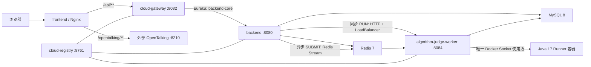

# 项目结构说明

> 更新日期：2026-08-13  
> 当前根目录：`D:\Ainterview`  
> 本文档以当前工作区真实代码、Maven 配置、前端路由、Flyway 脚本和 `docker-compose.yml` 为准。

## 1. 当前架构定位

AInterview 当前采用“**模块化单体业务核心 + 最小 Spring Cloud 基础设施 + 独立算法判题 Worker**”的渐进式架构，不是已经完成业务域拆分的全微服务系统：

- `backend` 仍集中承载认证、本人账户、安全活动、用户与权限、岗位、题库、面试、录制、媒体、AI 任务、报告、学习资料、反馈工单、通知和招聘主链路等业务。
- `cloud-registry` 提供 Eureka 服务注册与发现。
- `cloud-gateway` 负责 `/api/**` 的统一入口和基于服务发现的后端转发。
- `algorithm-judge-worker` 已从业务后端中独立，负责 Redis Stream 判题任务消费、Java 17 Docker 沙箱执行和判题结果落库。
- `frontend-react` 通过 Nginx 将 `/api/` 转发到 Gateway，将 `/opentalking/` 独立转发到外部 OpenTalking 服务。
- `backend` 与判题 Worker 当前仍共享 MySQL 和 Redis；除判题域外，其他业务域尚未拆成独立微服务。



## 2. 根目录

```text
Ainterview/
├─ .github/workflows/       GitHub Actions 质量门禁
├─ algorithm-judge-worker/  独立算法判题 Worker
├─ backend/                 核心业务后端（模块化单体）
├─ cloud-gateway/           Spring Cloud Gateway
├─ cloud-registry/          Eureka 注册中心
├─ frontend-react/          当前 React 前端与 Nginx 运行镜像
├─ runner-images/           Java 17 判题沙箱镜像上下文
├─ ops/                     Prometheus、Alertmanager、Grafana 配置
├─ deployment/              OpenTalking、Nginx、备份与恢复工具
├─ docs/                    当前设计、数据库、部署、知识库和迭代文档
├─ scripts/                 本地开发辅助脚本
├─ data/                    本地媒体运行目录（不提交）
├─ .env.example             可提交的环境变量模板
├─ docker-compose.yml       Compose 编排（项目名约定为 ainterview）
├─ pom.xml                  Maven 多模块聚合入口
├─ PRODUCT.md               产品与界面约束工作文件
└─ README.md                项目入口
```

`.agents/`、`.codex/`、`.impeccable/`、`.interface-design/` 和 `.idea/` 属于本地开发、设计或代理辅助内容，不参与应用运行；其中是否提交应按仓库维护策略单独判断，不能打入生产镜像。真实 `.env`、用户媒体、依赖目录和构建产物均不属于源码交付物。

## 3. Maven 多模块与版本基线

根 `pom.xml` 是聚合工程，当前包含四个 Maven 模块：

```text
ainterview-cloud-platform
├─ backend
├─ algorithm-judge-worker
├─ cloud-registry
└─ cloud-gateway
```

| 项目 | 当前代码基线 |
|---|---|
| Java | 17 |
| Spring Boot | 4.0.7 |
| Spring Cloud | 2025.1.2 |
| MyBatis-Plus | 3.5.17（backend、Worker） |
| MySQL | 8.0.36（Compose） |
| Redis | 7-alpine（Compose） |

`backend` 已从早期 Spring Boot 3.3.2 基线迁移到 4.0.7；后续依赖、测试和文档判断必须以各模块当前 `pom.xml` 为准。

## 4. 核心业务后端 `backend/`

```text
backend/
├─ src/main/java/com/tyut/aiinterview/
│  ├─ ai/                   DeepSeek、异步 AI 任务、追问和质量保护
│  ├─ algorithm/            算法 API、提交记录、任务发布和 Worker 客户端
│  ├─ account/              当前用户资料、头像、联系方式、密码、会话、通知偏好和安全活动
│  ├─ admin/                超级管理员工作台、企业、招聘、AI 运维和平台操作
│  ├─ auth/                 注册、登录、验证码和刷新令牌
│  ├─ common/               统一响应、异常和分页基础对象
│  ├─ config/               应用、Flyway、JSON、限流和上传安全配置
│  ├─ domain/               MyBatis-Plus 业务实体
│  ├─ evaluation/           面试评分
│  ├─ freeinterview/        简历驱动自由面试
│  ├─ interview/            常规模拟面试、状态流转和进度恢复
│  ├─ learning/             学习资料、PDF 版本、授权、阅读和批注
│  ├─ mapper/               MyBatis-Plus Mapper
│  ├─ media/                私有媒体上传、校验与鉴权访问
│  ├─ notification/         邮件同步与持久化站内通知
│  ├─ observability/        Actuator、Prometheus 和业务指标
│  ├─ position/             模拟面试岗位管理
│  ├─ prompt/               提示词版本、目录和渲染
│  ├─ question/             题库、分类和题目管理
│  ├─ recording/            录制会话、按题分段和时间轴
│  ├─ recruitment/          候选人简历、企业岗位、申请、匹配和招聘面试
│  ├─ reflection/           候选人面试心得
│  ├─ report/               面试报告、发布和查询
│  ├─ security/             JWT、Spring Security 和当前用户
│  ├─ settings/             AI Provider 与密钥加密
│  ├─ ticket/               反馈工单、附件、转派、时间线和状态机
│  ├─ user/                 用户、角色、权限和候选人管理
│  ├─ utils/                通用安全与数据工具
│  └─ virtualhuman/         OpenTalking 配置与服务端边界
├─ src/main/resources/
│  ├─ db/migration/         唯一有效的 Flyway 迁移目录（当前至 V40，共 33 个脚本）
│  ├─ prompts/defaults/     默认面试、评分和招聘匹配提示词
│  └─ application.yml       应用默认配置与环境变量入口
├─ src/test/                后端单元测试和 Spring 上下文测试
├─ pom.xml                  Boot 4、Cloud、Security、MyBatis、Flyway 等依赖
├─ Dockerfile               生产镜像构建
└─ Dockerfile.runtime       运行时镜像参考
```

后端不再包含 Docker 沙箱和 Redis Stream 判题消费者实现，也不挂载宿主机 Docker Socket。算法模块保留公共 API、权限校验、提交记录、任务发布及 Worker HTTP 客户端；真正的编译与执行位于独立 Worker。

招聘域当前由 `recruitment/` 包和对应实体/Mapper 共同组成，已经覆盖：

- 候选人私有简历上传、版本、结构化分析和解析状态；
- 企业、招聘岗位、岗位申请和申请状态历史；
- 候选人/企业双端申请查询与归属校验；
- 线下面试邀请、AI 面试创建和面试生命周期同步；
- 规则分 + AI 证据分的岗位匹配、重算、当前结果和历史快照。

本人账户能力由独立的 `account/` 模块提供，身份始终来自当前认证上下文，不接受请求体或查询参数中的 `userId`；候选人、企业用户和管理员均可读取和更新自己的白名单资料，候选人页面另外使用会话、通知偏好和安全活动接口。管理员平台的用户、企业、角色和运营能力仍由 `admin/` 与 `user/` 模块负责，未与本人账户接口混用。

OpenTalking 是当前唯一保留的虚拟人链路。`avatar-skill` 和讯飞相关实现未进入当前运行结构，不得从旧目录恢复。

## 5. 独立算法判题 Worker `algorithm-judge-worker/`

```text
algorithm-judge-worker/
├─ src/main/java/com/tyut/aiinterview/algorithmworker/
│  ├─ config/               Redis、Docker、内部 Token 和判题配置
│  ├─ domain/               判题所需的共享表实体映射
│  ├─ internal/             backend 同步 RUN 内网接口
│  ├─ judge/                任务消费、抢占、执行、持久化和状态流转
│  │  └─ archive/           输入/结果 tar 归档安全读写
│  ├─ mapper/               判题题目、提交、用例和进度 Mapper
│  └─ observability/        判题队列、结果、错误和耗时指标
├─ src/main/resources/application.yml
├─ src/test/                Worker 契约、安全和幂等测试
├─ pom.xml
└─ Dockerfile
```

Worker 的关键运行边界：

- 默认服务名为 `algorithm-judge-worker`，业务端口 `8084`，内部管理端口 `8085`。
- 同步自定义输入运行由 backend 经 Eureka/LoadBalancer 调用 `/api/internal/algorithm-judge/run`。
- 异步正式提交由 Worker 消费 Redis Stream `algorithm:judge:stream`。
- Worker 与 backend 共享现有算法相关数据库表，但 Worker 不执行 Flyway 迁移。
- Worker 是 AInterview 唯一允许挂载 `/var/run/docker.sock` 的服务。
- Java 代码在 `ai-java17-runner:2.0` 沙箱镜像中执行；沙箱禁网并受 CPU、内存、进程数、超时和输出大小限制。
- 内部调用支持 `X-Internal-Token`；生产环境应注入 Secret 并启用严格校验。

## 6. Spring Cloud 基础设施

### 6.1 注册中心 `cloud-registry/`

`cloud-registry` 是最小 Eureka Server，默认端口 `8761`，不注册自身，也不拉取注册表；暴露内部 Actuator health、info 和 Prometheus 指标。Compose 不向宿主机发布其端口。

### 6.2 网关 `cloud-gateway/`

`cloud-gateway` 使用 Spring Cloud Gateway WebFlux，默认业务端口 `8082`、管理端口 `8083`。当前只有一条业务路由：

```text
/api/**  ->  lb://backend-core
```

Gateway 通过 Eureka 发现 `backend-core`，当前不承载业务数据、Flyway、媒体文件或 OpenTalking 代理。JWT 与业务权限仍由 backend 执行；Gateway 主要提供统一入口和服务发现转发。

## 7. React 前端 `frontend-react/`

当前前端基线为 React 19.1、TypeScript 5.8、Vite 7、Tailwind CSS 4、React Router 7、Radix UI、Framer Motion、Monaco Editor 和 PDF.js 6；Node.js 构建要求为 22.13 及以上。

```text
frontend-react/
├─ src/
│  ├─ components/           公共组件、候选人/企业/管理端页面壳和业务面板
│  ├─ features/             Features 产品演示数据与交互 mockup
│  ├─ lib/                  API、会话、招聘、工单、通知、语音和 OpenTalking 工具
│  ├─ pages/
│  │  ├─ algorithm/         算法练习、提交、错题本和可视化实验室
│  │  ├─ candidate-*.tsx    候选人工作台、岗位、申请、简历、报告等页面
│  │  ├─ company-*.tsx      企业工作台、岗位管理和申请管理
│  │  ├─ admin-*.tsx        超级管理员业务页面
│  │  └─ ...                面试房间、自由面试、学习资料和公开页面
│  ├─ app.tsx               路由、权限包装和页面懒加载入口
│  └─ styles.css            全局样式、字体和设计令牌
├─ public/                  静态资源
├─ nginx/                   容器 Nginx 模板和 OpenTalking IPv4 解析脚本
├─ package.json             npm 依赖、Node 版本和质量脚本
├─ vite.config.ts           本地 `/api`、`/opentalking` 代理和构建分包
└─ Dockerfile               Node 构建 + Nginx 运行镜像
```

### 7.1 当前页面壳和路由分区

| 分区 | 页面壳 | 主要路由 |
|---|---|---|
| 公开页 | 独立页面 | `/`、`/features`、`/login` |
| 候选人端 | `CandidatePageShell` | `/workspace`、`/jobs`、`/applications`、`/resumes`、`/candidate/interviews`、`/algorithm/**`、`/learning-resources/**`、`/candidate/tickets/**` |
| 候选人账户 | `CandidatePageShell` | `/candidate/settings/profile`、`/candidate/settings/security`、`/candidate/settings/notifications`；`/candidate/settings` 和 `/users` 保留重定向并传递 query 参数 |
| 企业/HR 端 | `CompanyPageShell` | `/company`、`/company/positions/**`、`/company/applications/**`、`/company/interviews/**`、`/company/talent-pool/**`、`/company/team`、`/company/settings`、`/company/analytics/**` |
| 超级管理员端 | `AdminPageShell` | `/admin/workspace`、`/admin/companies/**`、`/admin/users/**`、`/admin/roles`、`/admin/recruitment/**`、`/admin/ai-operations/**`、`/admin/interviews/**`、`/admin/candidates/**`、`/admin/question-banks/**`、`/admin/tickets/**`、`/admin/algorithm/problems`、`/admin/learning-resources/**`、`/admin/prompt-templates`、`/admin/ai-generations`、`/admin/audit-logs`、`/admin/operations`、`/admin/settings` |
| 面试专用页 | 独立受保护页面 | `/candidate/interviews/:id/room`、`/candidate/interviews/:id/report`、`/candidate/free-interview` |

当前 `frontend-react/src/app.tsx` 保持页面懒加载；账户设置的资料、安全和通知页共享一次 `CandidatePageShell`，旧 `/users` 仅作兼容重定向。企业端已经包含面试、人才库、团队和分析域；超级管理员端已经包含企业、用户、角色、招聘和 AI 运维域。后续页面扩展应在不改变现有路由权限的前提下进行。

### 7.2 前端运行边界

- 浏览器只访问同源 `/api` 和 `/opentalking`，不得接收数据库、内部 Token 或第三方服务密钥。
- `index.html` 使用 no-store，带 hash 的静态资源使用 immutable 缓存，减少发布后旧入口引用已删除 chunk 的风险。
- PDF.js worker 由 Vite 构建为 `pdf.worker.min-*.mjs`；生产 Nginx 必须以 `application/javascript` 返回 `.mjs`。
- `node_modules/`、`dist/` 和 `*.tsbuildinfo` 可重新生成，不进入仓库。

## 8. 数据库与 Flyway

唯一有效的数据库迁移源是：

```text
backend/src/main/resources/db/migration/
```

当前目录共有 33 个版本化脚本，版本序列为 V1、V9–V40，最新发布脚本为 `V40__create_account_security_foundation.sql`。Flyway 配置使用 `baseline-version: 8`、`validate-on-migrate: true`、`out-of-order: false`。

招聘链路新增迁移如下：

| 版本 | 作用 |
|---|---|
| V27 | 公司、招聘岗位、候选人简历、岗位申请、状态历史和线下面试基础结构 |
| V28 | 候选人简历结构化分析 |
| V29 | 私有媒体允许简历文件类型 |
| V30 | 申请 AI 匹配状态、分数和详情 |
| V31 | 版本化岗位匹配评估与证据快照 |
| V32 | 补齐匹配摘要、命中技能、风险和建议字段 |
| V33 | 将既有完成态匹配数据回填为只读历史快照 |
| V34 | 企业团队角色和权限基础结构 |
| V35 | 企业面试状态历史 |
| V36 | 脱敏操作审计日志 |
| V37 | 企业人才库及标签关系 |
| V38 | 企业招聘联系人 |
| V39 | 角色版本乐观锁字段 |
| V40 | 账户安全基础：头像媒体绑定、联系方式验证时间、security version、资料 version、Refresh Token 会话字段和通知偏好 |

V40 及以前已发布迁移禁止修改；下一次数据库结构变更必须先重新检查目录最高版本，若无新增脚本则从 V41 开始。应用启动时只有 backend 执行 Flyway，Worker、Gateway 和注册中心不执行迁移。

学习资料 PDF、简历、录制和工单附件均复用私有媒体存储；数据库保存元数据、授权关系、摘要和业务记录，原始文件不进入前端构建产物。

## 9. Docker Compose 与运行服务

Compose 项目名约定为 `ainterview`。默认配置包含 7 个服务；`judge` 和 `monitoring` profile 提供可选镜像构建或监控服务。

| 服务 | 默认启动 | 内部端口 | 职责与边界 |
|---|---:|---|---|
| `mysql` | 是 | 3306 | MySQL 8 业务数据库，使用 `mysql_data` |
| `redis` | 是 | 6379 | 缓存、限流、AI/判题任务协调，使用 `redis_data` |
| `cloud-registry` | 是 | 8761 | Eureka 注册中心，仅私网 |
| `algorithm-judge-worker` | 是 | 8084 / 8085 | 判题服务与管理端口；唯一挂载 Docker Socket |
| `backend` | 是 | 8080 / 8081 | 核心业务 API 与内部 Actuator；仅挂载媒体卷 |
| `cloud-gateway` | 是 | 8082 / 8083 | `/api/**` 服务发现路由与内部 Actuator |
| `frontend` | 是 | 80 | 唯一默认发布到宿主机的应用入口 |
| `java-runner` | `judge` profile | 无常驻端口 | 构建 `ai-java17-runner:2.0`，不作为常驻服务 |
| `prometheus` | `monitoring` profile | 9090 | 指标抓取与告警规则，默认仅绑定 `127.0.0.1` |
| `alertmanager` | `monitoring` profile | 9093 | 告警汇聚，默认仅绑定 `127.0.0.1` |
| `grafana` | `monitoring` profile | 3000 | 预置 AInterview 监控看板，默认仅绑定 `127.0.0.1` |

主要持久化卷：

```text
mysql_data
redis_data
media_data
prometheus_data
alertmanager_data
grafana_data
```

普通更新不得执行 `docker compose down -v`，也不得删除或重建 MySQL、Redis、媒体和监控数据卷。Worker 可以按副本扩容；每个实例通过随机 Eureka instance-id 注册，并使用独立 Redis consumer 名称。

## 10. 监控、部署与判题镜像

```text
ops/monitoring/
├─ prometheus.yml
├─ alert.rules.yml
├─ alertmanager.yml
└─ grafana/
   ├─ dashboards/ainterview-overview.json
   └─ provisioning/

deployment/
├─ nginx/                   独立部署 Nginx 参考
├─ opentalking/             OpenTalking 配置样例与同步工具
├─ opentalking-mock/        本地 Mock 辅助目录
└─ scripts/                 生产备份和完整性验证

runner-images/java17/
├─ Dockerfile
└─ run-all.sh
```

Prometheus 当前抓取 backend、Worker、Gateway 和注册中心的内部指标；Grafana 通过 provisioning 加载 `AInterview 运行监控`。外部通知接收器、生产密钥和公网访问策略由部署环境提供，不能写入仓库。

OpenTalking 的真实运行目录和凭据位于独立环境，不随本仓库打包。仓库仅保留同源代理、配置模板、Mock 辅助内容和同步工具。

## 11. 文档与 CI

```text
docs/
├─ README.md                文档索引
├─ CHANGELOG.md             唯一持续更新日志
├─ project-structure.md     本项目结构说明
├─ REPOSITORY_MIGRATION.md  仓库迁移与接管指南
├─ iteration-plan.md        当前能力与下一迭代
├─ iterations/              迭代汇总
├─ database/                Flyway 规则、数据字典和测试数据
├─ deployment/              服务器、更新和运维文档
└─ knowledge-base/          当前技术知识库
```

`.github/workflows/quality.yml` 当前执行：

- backend 模块 Maven 测试；
- 前端 `npm ci`、build 和 lint；
- Docker Compose 配置校验。

根 Maven 聚合工程可用于本地一次验证 backend、Worker、Gateway 和注册中心；当前 CI 的 Maven job 仍以 `backend/` 为工作目录，尚未覆盖完整聚合 Reactor，这是后续可补齐的质量门禁项。

## 12. 运行时与提交边界

| 路径/内容 | 是否提交 | 说明 |
|---|---:|---|
| `.env`、Token、API Key、数据库密码、证书私钥 | 否 | 每个环境独立创建和保护 |
| `backend/target/`、各 Cloud/Worker `target/` | 否 | Maven 构建产物 |
| `frontend-react/node_modules/`、`dist/` | 否 | npm 依赖和前端构建产物 |
| `data/media/`、`uploads/`、`backend/data/` | 否 | 用户媒体和本地运行数据 |
| `*.log` | 否 | 运行日志 |
| MySQL、Redis、媒体和监控 Docker 卷 | 否 | 通过备份流程单独迁移 |
| `.env.example`、Compose、Dockerfile、Flyway | 是 | 不得包含真实凭据 |

## 13. 文档同步规则

| 变更类型 | 至少同步更新 |
|---|---|
| 日常功能、配置、UI 或修复 | 只持续更新 `docs/CHANGELOG.md`，不另建更新文档 |
| 数据库结构变更 | 新增后端 Flyway 迁移并登记 `docs/CHANGELOG.md`；不要复制可执行 SQL 到文档目录 |
| 环境变量、端口、卷或代理 | 更新实际配置模板/部署手册，并登记 `docs/CHANGELOG.md` |
| 项目结构与阶段总结 | 仅在用户明确要求时更新本文件、README、索引、设计或总结文档 |
| 新文档 | 默认不创建；优先修改已有文档，除非用户明确要求新增 |

所有后续结构判断都应先检查当前 Git 工作区、根/模块 `pom.xml`、`frontend-react/src/app.tsx`、Flyway 目录和 `docker-compose.yml`，不得仅依赖历史文档中的旧版本说明。
